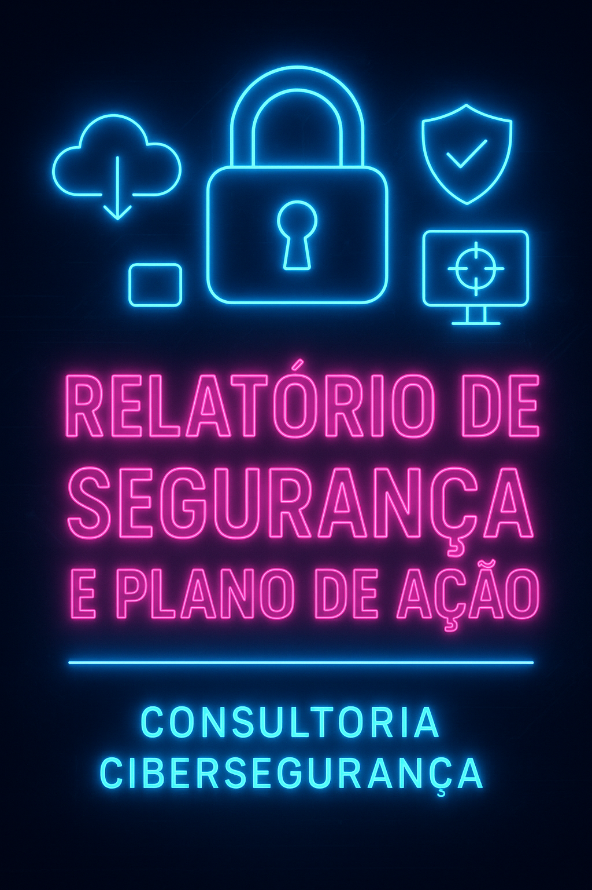
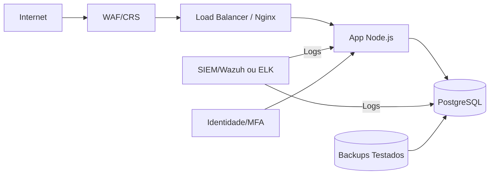
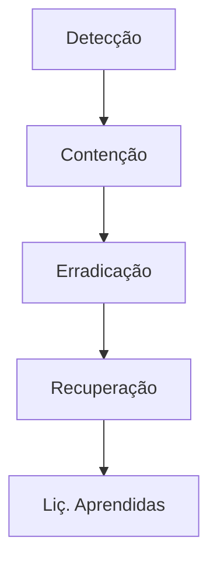

## Relatório de Segurança e Plano de Ação

**Cliente:** LojaZeta  
**Data:** 27.09.2025  
**Autor:** Tiago Pimenta 

## 1. Sumário Executivo

A **LojaZeta** é um e-commerce em crescimento hospedado em nuvem (**Nginx + Node.js + PostgreSQL**) que sofreu incidentes recentes envolvendo **SQL Injection, XSS e brute-force em /login**.

### Riscos-chave
- **Ausência de SIEM:** logs dispersos em instâncias diferentes.  
- **Superfície web vulnerável:** app exposto sem WAF.  
- **Identidade frágil:** sem MFA em acessos administrativos.  
- **Backups sem teste de restauração.

### Visão da Solução
- Defesa em profundidade: WAF, IDS/IPS, hardening de app e DB, MFA.  
- Monitoramento centralizado mínimo viável (**SIEM**).  
- Plano de resposta a incidentes (**NIST IR**) com runbooks simples.

### Ganhos Esperados
- Redução imediata de ataques web (SQLi/XSS).  
- Maior visibilidade centralizada via SIEM.  
- Capacidade de resposta estruturada e rápida.  
- Continuidade garantida por testes de backup.  

---

## 2. Escopo e Metodologia

### Escopo
- Infraestrutura em nuvem exposta (**Nginx, Node.js, PostgreSQL**).  
- Segurança em camadas: rede, aplicação, identidade, dados e backup.  
- Monitoramento centralizado e plano de resposta.  

### Metodologia
- Revisão de incidentes recentes e logs disponíveis.  
- Análise de arquitetura e controles existentes.  
- Aplicação de boas práticas de Blue Team.  
- **Priorização 80/20** (ações rápidas em 30 dias).  

---

## 3. Arquitetura de Defesa (Camadas)

### Controles Recomendados

- **Perímetro:** WAF (ModSecurity ou cloud-native), IDS/IPS (Suricata).  
- **Aplicação:** hardening do Nginx, rate limiting no /login, validação de input.  
- **Banco:** roles mínimas, TLS habilitado, auditoria de queries.  
- **Identidade:** MFA obrigatória, rotação periódica de credenciais.  
- **Backups:** testes mensais de restauração, storage segregado.  

---

## 4. Monitoramento & SIEM

### Fontes de Log
- **Nginx:** acessos/erros.  
- **Node.js:** autenticação, requests.  
- **PostgreSQL:** falhas de login, superuser.  
- **Sistema:** SSH, sudo.  

### Correlação/Alertas
- 5 falhas de login em <1min.  
- Padrões SQLi/XSS em requests.  
- Acesso SSH de IP não autorizado.  

### Casos de Uso de Alertas (Exemplo)
| Caso de Uso           | Fonte de Log           | Ação/Alerta               | Prioridade |
|----------------------|----------------------|---------------------------|------------|
| Brute-force login     | App (auth.log)        | >5 falhas em 1 min        | Alta       |
| SQLi                  | Nginx + DB            | Regex suspeita            | Alta       |
| XSS                   | Node.js requests      | Payload detectado         | Média      |
| SSH suspeito           | Sistema (auth.log)    | IP fora do padrão         | Média      |

### KPIs/Métricas
- **MTTD** (Mean Time to Detect)  
- **MTTR** (Mean Time to Respond)  
- % de logs cobertos  
- Nº de ataques bloqueados/prevenidos  

---

## 5. Resposta a Incidentes (NIST IR)

### Ciclo NIST IR

### Runbooks (Exemplos)
- **SQLi detectada:** bloquear padrão no WAF, revisar queries parametrizadas.  
- **XSS:** atualizar filtros de input, bloquear payload no WAF.  
- **Brute-force login:** bloquear IP, habilitar CAPTCHA, rate limiting.  
- **Indisponibilidade app:** rollback versão anterior, coletar evidências, restaurar backup se necessário.  

### SLA Recomendada
- Contenção de brute-force: ≤ 15 min  
- Correção de SQLi: ≤ 30 min  
- Atualização de filtros XSS: ≤ 30 min  

---

## 6. Recomendações (80/20) e Roadmap

### Quick Wins (0-30 dias)
| Ação               | Responsável | Impacto Esperado                  |
|-------------------|------------|----------------------------------|
| Ativar WAF         | Ops        | Reduz ataques SQLi/XSS           |
| Centralizar logs   | Ops        | Visibilidade de incidentes       |
| MFA admins         | Gestão     | Mitiga brute-force               |
| Testar backup      | Ops        | Garantia de restauração          |
| Rate limiting /login | Dev      | Reduz força bruta                |

### Médio Prazo (30-90 dias)
| Ação                  | Responsável | Impacto Esperado               |
|----------------------|------------|-------------------------------|
| IDS/IPS               | Ops        | Detecção de intrusões          |
| Hardening Nginx/DB    | Dev/Ops    | Reduz vulnerabilidades         |
| Revisar roles/privil. | Dev        | Minimiza privilégios excessivos|

### Longo Prazo (90-180 dias)
| Ação                  | Responsável | Impacto Esperado               |
|----------------------|------------|-------------------------------|
| Expandir SIEM         | Ops        | Threat Intelligence integrado  |
| Treinamentos internos | Gestão     | Cultura de segurança           |
| Automatizar resposta  | Ops/Dev    | Resposta mais rápida (SOAR)   |

---

## 7. Riscos, Custos e Assunções

- **Limitações:** equipe reduzida (2 devs, 1 ops).  
- **Custos:** WAF open-source, Wazuh (baixo custo). Cloud SIEM (AWS/Azure) se orçamento permitir.  
- **Assunções:** backups existem e podem ser validados; equipe disponível para quick wins; ambiente em nuvem com suporte a firewall/WAF.  

---

## 8. Conclusão

A LojaZeta precisa evoluir sua maturidade de segurança rapidamente para suportar o crescimento do e-commerce.  
O plano proposto garante ganhos imediatos com WAF, SIEM, MFA e testes de backup, ao mesmo tempo em que define roadmap escalável para médio e longo prazo.

### Critérios de sucesso
- Redução de ataques bem-sucedidos.  
- Visibilidade centralizada de incidentes.  
- Backups confiáveis.  
- Equipe apta a responder incidentes com clareza.  

